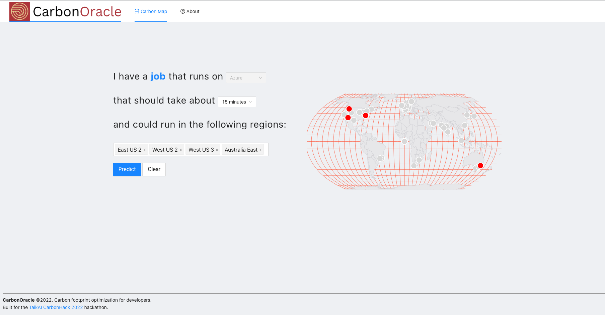
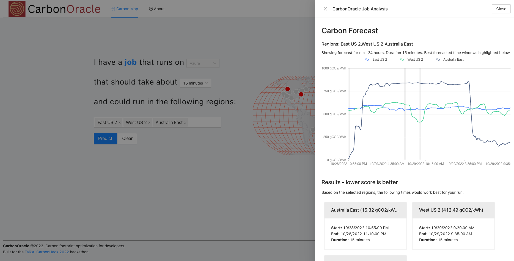
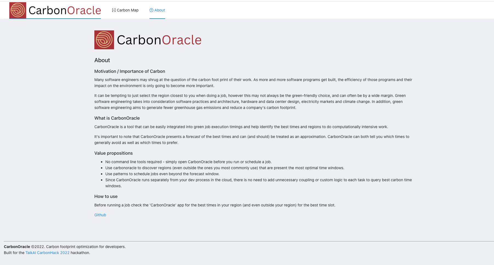

 

    

 

CarbonOracle
---

A prediction platform for software and job carbon footprint minimization on the Azure network.

Built for the <a href="https://taikai.network/gsf/hackathons/carbonhack22" target="_blank">TaikAI Carbon hack 2022.</a>

Live Demo: <a href='https://carbonoracle.surge.sh' target="_blank">https://carbonoracle.surge.sh</a>

Participant deck: <a href="https://docs.google.com/presentation/d/1nRzRlhCGZpVwF7Yg8VjK8B5mtNe3yi7gUCPn5caGmxw/edit?usp=sharing" target="_blank">CarbonOracle Pitch</a>

Demo video: https://youtu.be/GGyvJMkIkHY

# Running locally
Terminal 1: 
<pre>
cd proxy-server; yarn; yarn start
</pre>

Terminal 2: 
<pre>
yarn; yarn start
</pre>

Website should now be running on port 3000 (with API server on 3001).

### Motivation / Importance of Carbon

Many software engineers may shrug at the question of the carbon foot print of their work. As more and more software programs get built, 
the efficiency of those programs and their impact on the environment is only going to become more important.

It can be tempting to just select the region closest to you when doing a job, however this may not always be the green-friendly choice, and can often be by a wide margin.
Green software engineering takes into consideration software practices and architecture, hardware and data center design, electricity markets and climate change. In addition, green software engineering aims to generate fewer greenhouse gas emissions and reduce a company's carbon footprint.

CarbonOracle is a tool that can be easily integrated into green job execution timings and help identify the best times and regions to do computationally intensive work.

It's important to note that CarbonOracle presents a *forecast* of the best times and can (and should) be treated as an approximation. CarbonOracle can both tell you which times to generally avoid as well as which times to prefer.

### Value propositions
* Use CarbonOracle to discover regions (even outside the ones you most commonly use) that are present the most optimal time windows.
* Use patterns to schedule jobs even beyond the forecast window.
* Since CarbonOracle runs separately from your dev process in the cloud, there is no need to add unnecessary coupling or custom logic to each task to query best carbon time windows 
* No command line tools required - simply open CarbonOracle before you run or schedule a job.

### How to use

Before running a job check the `CarbonOracle` app for the best times in your region (and even outside your region) for the best time slot.

### Potential future work:
* Suggest regions to run the load if the user didn't select a region with great carbon emissions.
* Add history tab to the site to compare accuracy of forecasts.
* Add discussion tab for software developers to collaborate and share thoughts on how to best optimize for carbon footprint.
* Expand region analysis to other cloud service platforms (GCP, AWS, DigitalOcean, etc.)
* More dynamic recomendations based on job to be done.
* Create integrations that can support querying CarbonOracle in real time in pipeline flow.
* Connect users of the site to additional resources / incentives for prioritizing green work.
* Add user logins and create a business platform that enables companies to track their net engineering green performance on a dashboard.

### Screenshots

#### Selecting regions

#### Predictions (real-time / dynamically generated)

#### About page

### Useful links
* https://taikai.network/gsf/hackathons/carbonhack22
* https://github.com/Green-Software-Foundation/carbon-aware-sdk
* https://docs.google.com/document/d/16P5XCQwn5wm1Sf-S496i0yliUDqEBTYC73ZCxW-iXL8/edit#heading=h.s93ajhcngbd3

